# FIAP Tech Challenge

[](https://github.com/alankano/fiap-tech-challenge)

Descrição
---------
Repositório com a solução para o "FIAP Tech Challenge". Este projeto contém a implementação do desafio técnico, instruções para executar localmente, rodar testes e informações sobre a arquitetura e decisões técnicas.

Arquitetura
------------
Aplicação Spring Boot organizada em camadas: 
- Controllers (API) → Services (regras) → Repositories (acesso a dados).
- Persistência por SQL externo carregado via SqlQueryLoader e executado com Spring JdbcClient (mapeamento manual para POJOs).
- Documentação via OpenAPI/Swagger; empacotamento em fat-jar e execução via Docker.
- Código utiliza Lombok para reduzir boilerplate e segue convenções REST para endpoints e códigos HTTP.

Modelagem das entidades e relacionamentos;
---------------
- Usuario - entidade completa (mapeia para toda a linha da tabela usuarios).

  | Campo | Tipo | Obrigatório | Descrição |
  |---|---:|:---:|---|
  | `id` | Long | Sim | Chave primária; gerada automaticamente. |
  | `nome` | String | Sim | Nome completo do usuário. |
  | `email` | String | Sim, único | Email válido para contato e recuperação; único no sistema. |
  | `login` | String | Sim, único | Nome de usuário para autenticação; único. |
  | `senha` | String | Sim | senha |
  | `dataUltimaAlteracao` | LocalDate | Sim | Data da última modificação dos dados do usuário. |
  | `endereco` | String | Não | Endereço completo (rua, número, complemento, cidade, etc.). |
  | `tipoUsuario` | String | Sim | Perfil/role do usuário (ex.: `ADMIN`, `USER`); controla permissões. |

- Senha - DTO/projeção usada para operações de alteração/consulta de senha (consultas usam a coluna senha da tabela usuarios).

| Campo | Tipo | Obrigatório | Descrição |
  |---|---:|:---:|---|
  `id` | Long | Sim | Identificador do usuário; usado para identificar a conta alvo da alteração.
  `senhaAtual` | String | Sim | Senha atual para validação antes de alterar.
  `novaSenha` | String | Sim | Nova senha desejada.
  `novaSenha2` | String | Sim | Confirmação da nova senha; deve ser igual a `novaSenha`.
  `dataUltimaAlteracao` | LocalDate | Não | Data da atualização da senha (preenchida pelo servidor).

- Login - DTO/projeção usada para operações de autenticação (login).

| Campo | Tipo | Obrigatório | Descrição |
  |---|---:|:---:|---|
`login` | String | Sim | Nome de usuário para autenticação.
`senha` | String | Sim | Senha para autenticação.

Descrição dos endpoints
---------------
## GET /usuarios
- Descrição: busca todos os usuários com paginação.
- Query params obrigatórios: page (Integer), size (Integer)
- Validações: lança BadRequestException se page ou size ausentes ou inválidos (page < 0 ou size <= 0).
- Resposta: 200 OK com body List<Usuario>.
- Exemplo de response (200):

``` 
[
    {
        "id": 2,
        "nome": "mozao",
        "email": "mozao@gmail.com",
        "login": "mozao",
        "senha": "panda321",
        "dataUltimaAlteracao": "2026-01-19",
        "endereco": "SAO PAULO, SP",
        "tipoUsuario": "2"
    },
    {
        "id": 3,
        "nome": "mozao",
        "email": "mozao1@gmail.com",
        "login": "mozao",
        "senha": "mozao123",
        "dataUltimaAlteracao": "2026-01-19",
        "endereco": "SAO PAULO, SP",
        "tipoUsuario": "2"
    },
    {
        "id": 4,
        "nome": "Kelvin",
        "email": "alankano@gmail.com",
        "login": "Panda",
        "senha": "panda123",
        "dataUltimaAlteracao": "2026-01-19",
        "endereco": "VILELA",
        "tipoUsuario": "2"
    }
]
```

## GET /usuarios/buscaNome
- Descrição: busca usuários cujo nome contenha o termo (case-insensitive).
- Query param obrigatório: nome (String)
- Validações: lança BadRequestException se nome ausente.
- Resposta: 200 OK com body List<Usuario>.
- Exemplo de response (200):
```
[
    {
        "id": 2,
        "nome": "mozao",
        "email": "mozao@gmail.com",
        "login": "mozao",
        "senha": "mozao123",
        "dataUltimaAlteracao": "2026-01-19",
        "endereco": "SAO PAULO, SP",
        "tipoUsuario": "2"
    },
    {
        "id": 3,
        "nome": "mozao",
        "email": "mozao1@gmail.com",
        "login": "mozao",
        "senha": "mozao123",
        "dataUltimaAlteracao": "2026-01-19",
        "endereco": "SAO PAULO, SP",
        "tipoUsuario": "2"
    }
]
```
## GET /usuarios/{id}
- Descrição: busca usuário por id.
- Path param: id (Long) — obrigatório.
- Validações: lança BadRequestException se id for nulo.
- Resposta: 200 OK com body Usuario.
- Exemplo de response (200):
```
{
    "id": 2,
    "nome": "mozao",
    "email": "mozao@gmail.com",
    "login": "mozao",
    "senha": "mozao123",
    "dataUltimaAlteracao": "2026-01-19",
    "endereco": "SAO PAULO, SP",
    "tipoUsuario": "2"
}
```

## POST /usuarios
- Descrição: cria um novo usuário.
- Body (JSON) — 
- Validações: controller usa @Valid para validar campos nulos
- Resposta: 201 Created (o controller retorna status 201 sem body).
- Exemplo de request:
```
{
"nome": "Kelvin",
"email": "kelvin@gmail.com",
"login": "Panda",
"senha": "panda123",
"endereco": "VILELA",
"tipoUsuario": "2"
}
```
- Exemplo de response (400):
```
  {
  "message": "Email já cadastrado: alankano@gmail.com",
  "status": 400
  },
  {
    "message": "Todos os campos são obrigatórios para salvar o usuário.",
    "status": 400
  }
```

## PUT /usuarios/{id}
- Descrição: atualiza usuário existente (por id).
- Path param: id (Long)
- Body (JSON): objeto Usuario com os novos valores.
- Exemplo de request:
```
{
    "nome": "Alan Kano",
    "email": "alan.kano@gmail.com",
    "login": "alankano",
    "endereco": "SAO PAULO, SP",
    "tipoUsuario": "2"
}
```
- Resposta: 204 No Content (controller monta response com HttpStatus.NO_CONTENT).

## DELETE /usuarios/{id}
- Descrição: exclui usuário por id.
- Path param: id (Long)
- Resposta: 204 No Content

## POST /login
- Descrição: valida login do usuário.
- Body (JSON) — DTO Login: { "login": "alankano", "senha": "123" }
- Comportamento: Se credenciais forem válidas, o controller retorna 204 No Content
- Erros: LoginService lança InvalidLoginException quando não há correspondência
- Exemplo de request:
```
{   
    "login": "mozao",
    "senha": "panda321"
}
```
## PUT /senha/{id}
- Descrição: atualiza a senha do usuário identificado por id.
- Path param: id (Long) — obrigatório; há também um PUT /senha (sem id) que apenas lança BadRequest explicando que id é obrigatório.
- Comportamento: Atualiza a coluna senha da tabela usuarios 
- Resposta: 204 No Content (controller usa HttpStatus.NO_CONTENT).
- Exemplo de request:
```
{
    "senha": "mozao123",
    "novaSenha": "panda321",
    "novaSenha2": "panda321"
}
```

Descrição da documentação Swagger
---------------

## Endpoints 
### Update Senha
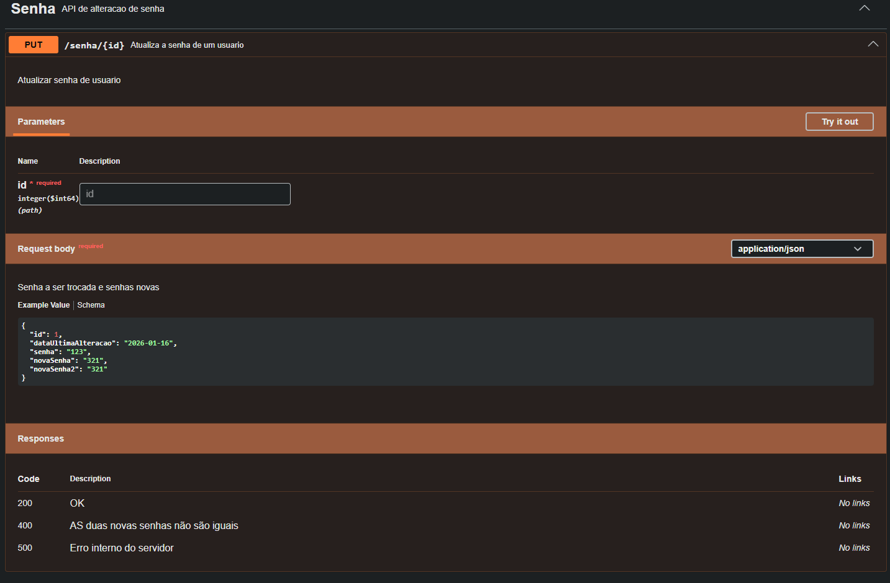

### Busca usuario por id
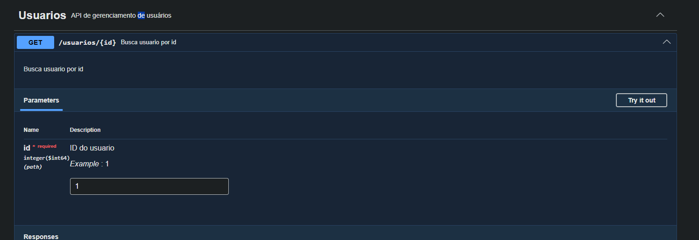

### Update usuario por id
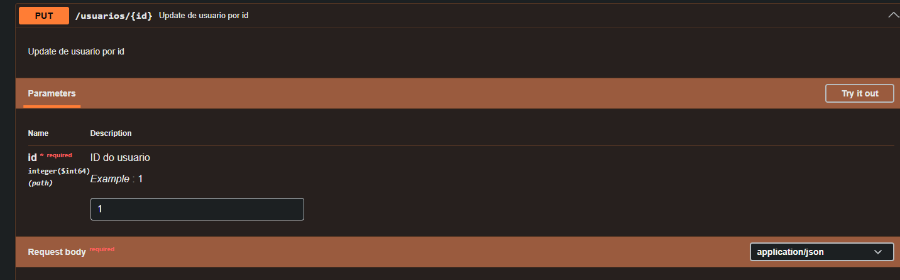

### Delecao do usuario por id
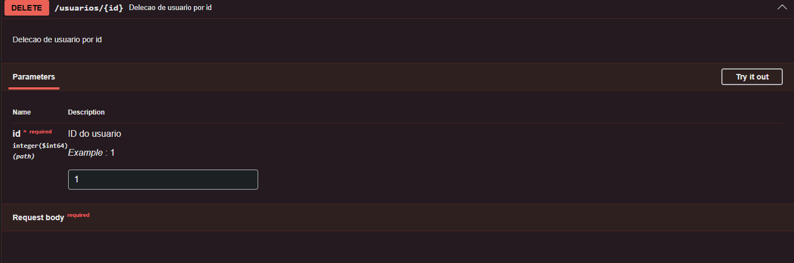

### Busca todos os usuarios
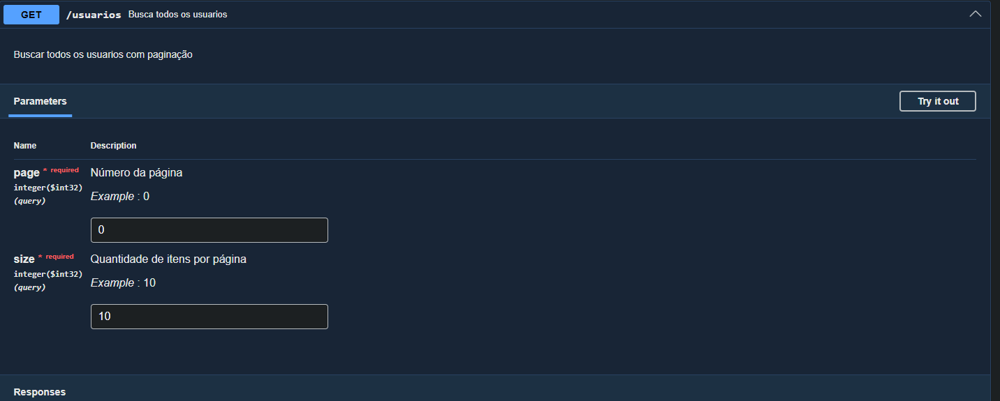

### Salva usuario 
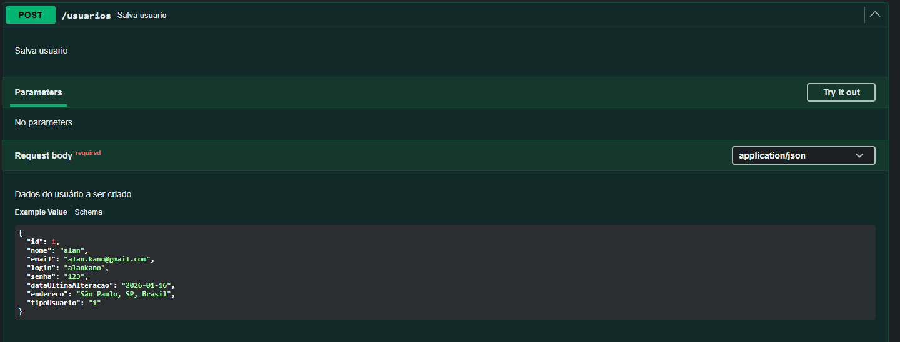

### Busca usuario por nome 
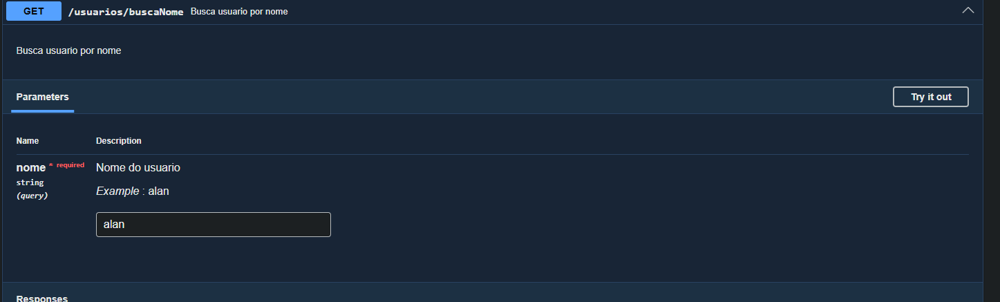

### Validacao Login
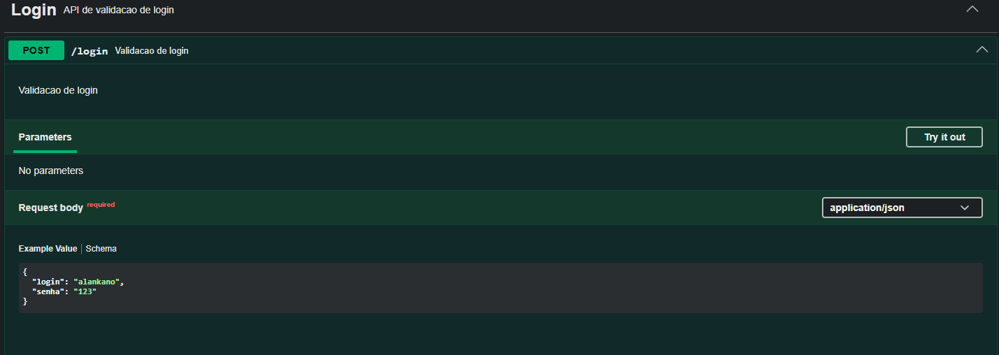

## Schemas
### Usuario
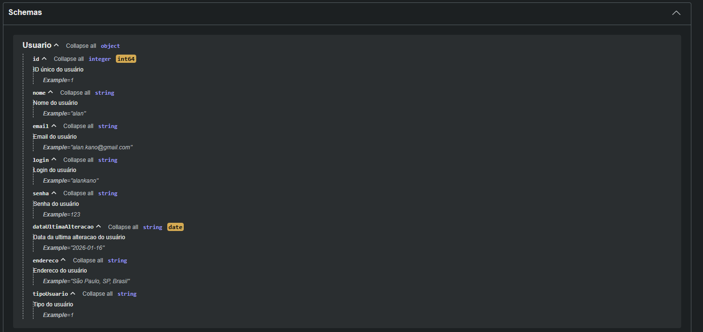

### Senha
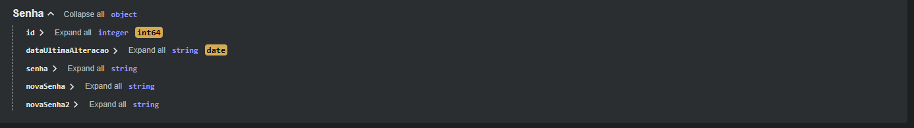

### Login
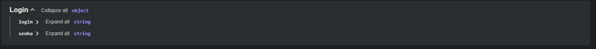

Descrição da coleção postman
---------------

## Usuarios
#### Get Usuarios
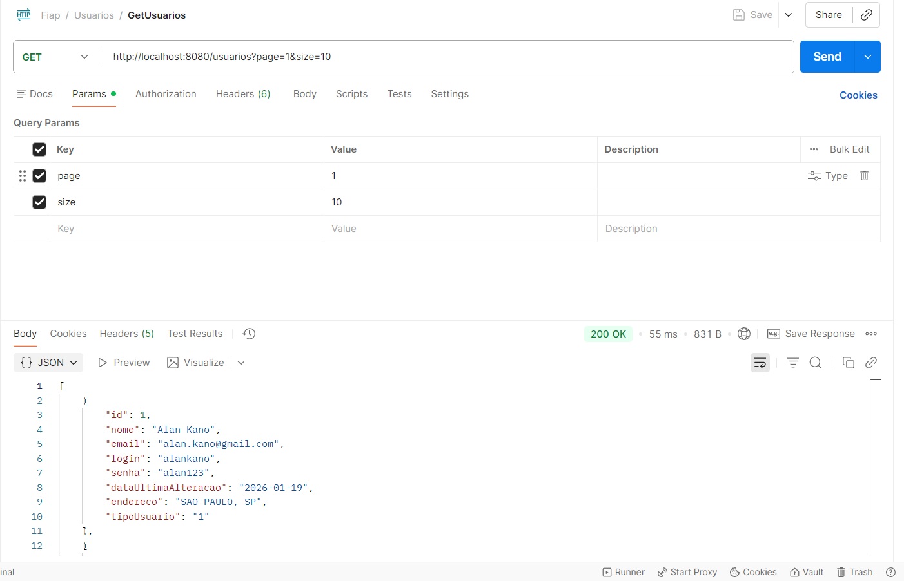

#### Get Usuario By Id
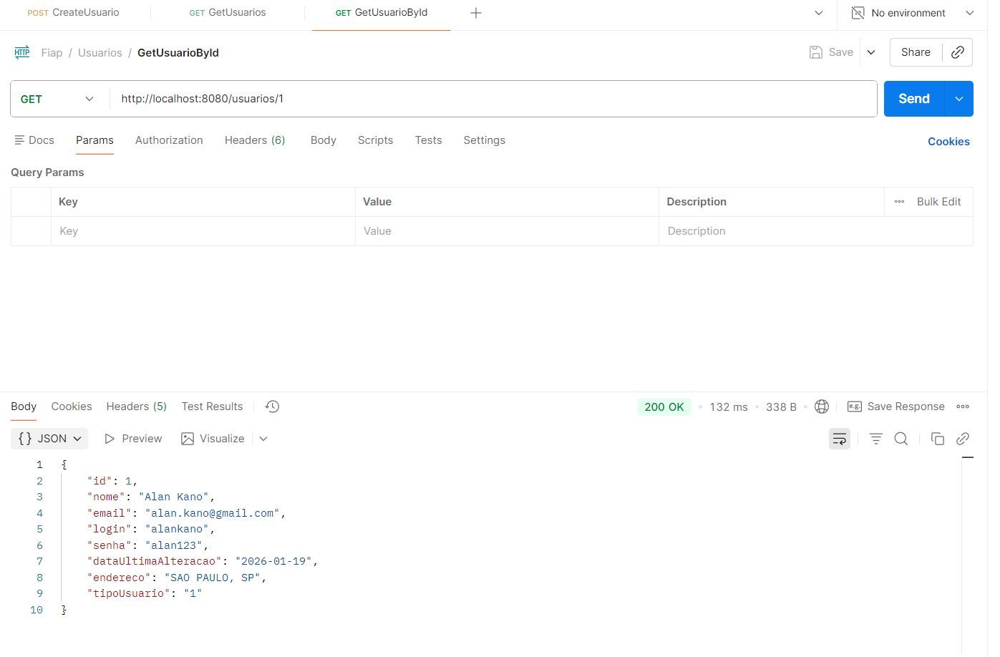

#### Get Usuario By Nome
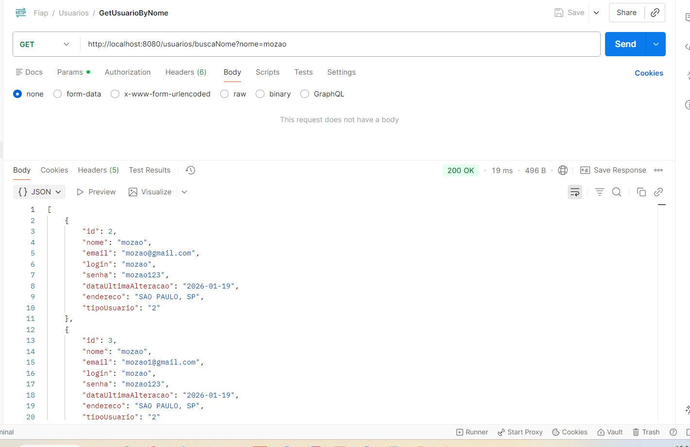  

#### Create Usuario
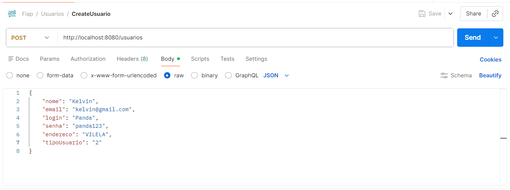

#### Create Usuario Campos Faltando
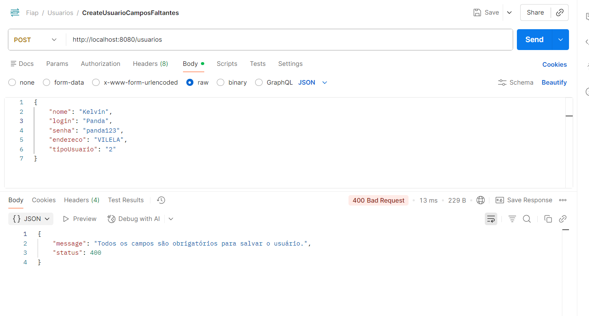

#### Create Usuario Email duplicado
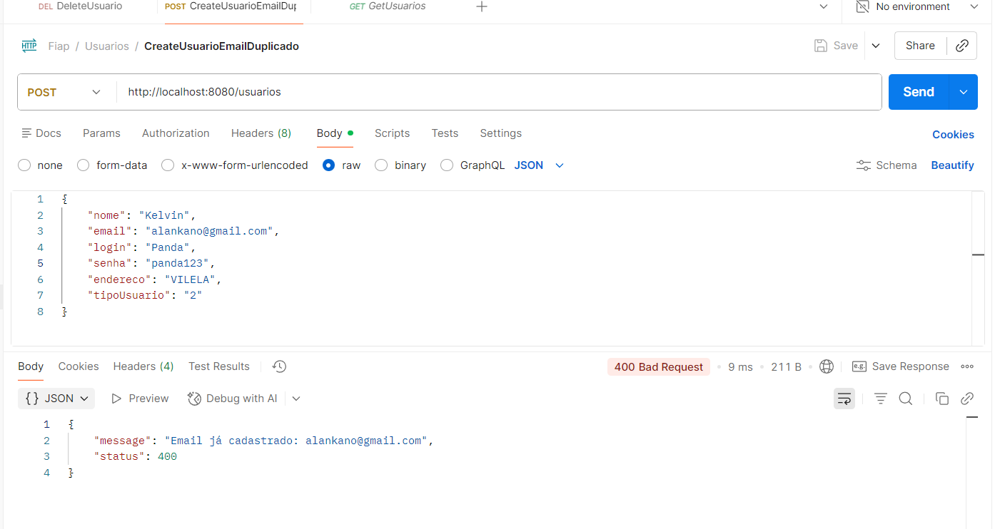

#### Update usuario
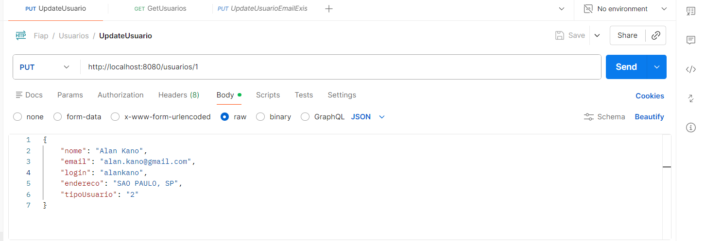

## Senha
### Update senha com sucesso
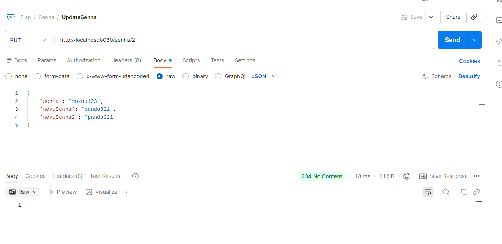

### Update senha senha incorreta
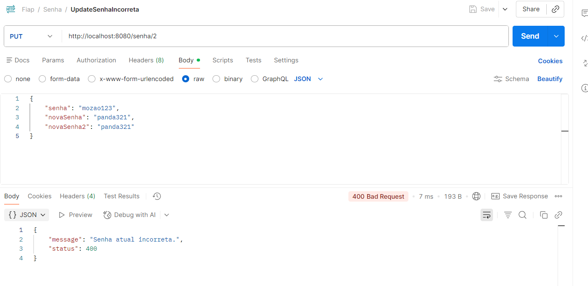

### Update senha senha não são iguais
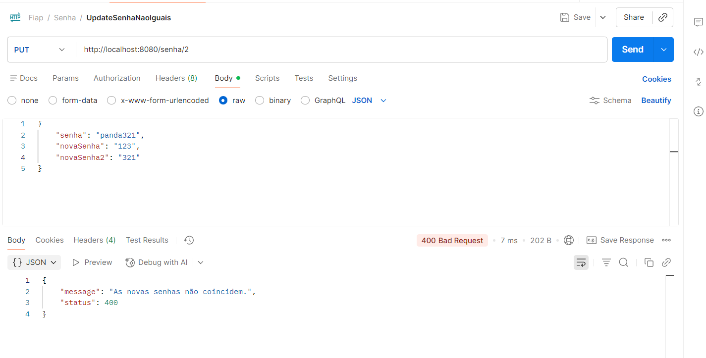

## Login
### Login com sucesso
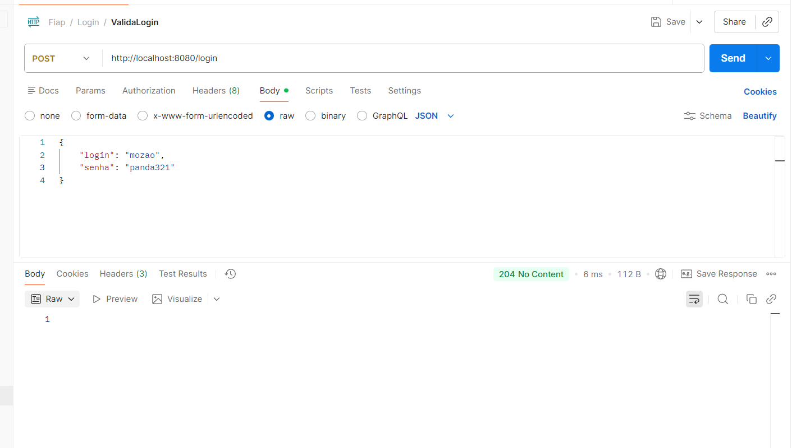

### Login inválido
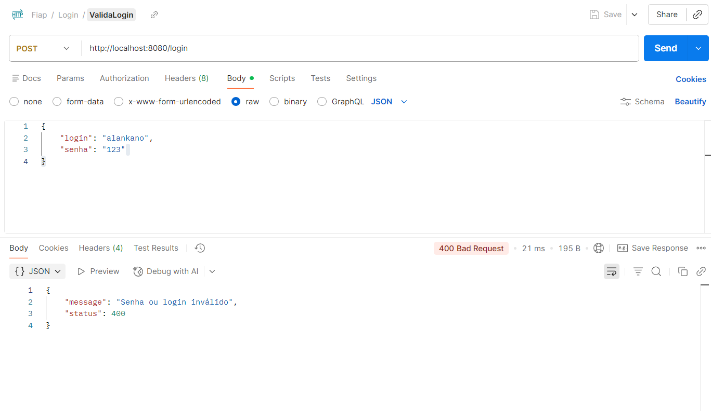

Estrutura do banco de dados (tabelas);
------------------------------------
## No momento há apenas duas tabela: usuarios e tipoUsuarios

### usuarios
| Campo | Tipo | Obrigatório | Descrição |
  |---|---:|:---:|---|
| `id` | Long | Sim | Chave primária; gerada automaticamente. |
| `nome` | String | Sim | Nome completo do usuário. |
| `email` | String | Sim, único | Email válido para contato e recuperação; único no sistema. |
| `login` | String | Sim, único | Nome de usuário para autenticação; único. |
| `senha` | String | Sim | senha |
| `dataUltimaAlteracao` | LocalDate | Sim | Data da última modificação dos dados do usuário. |
| `endereco` | String | Não | Endereço completo (rua, número, complemento, cidade, etc.). |
| `tipoUsuario` | String | Sim | Perfil/role do usuário (ex.: `ADMIN`, `USER`); controla permissões. |

### tipoUsuarios

| Campo                 | Tipo | Obrigatório | Descrição                                                                     |
  |-----------------------|---:|:---:|-------------------------------------------------------------------------------|
| `idTipo`              | Long | Sim | Chave primária; gerada automaticamente.                                       |
| `tipo`                | String | Sim | Perfil/role do usuário (ex.: `1 - CLIENTE`, `2 - DONO`); controla permissões. |

Configuração (variáveis de ambiente)
------------------------------------
### LOCAL
- DB_URL=jdbc:h2:mem:localtech 
- DB_USERNAME=sa
- DB_PASSWORD=password
- DB_DRIVER_CLASS_NAME=org.h2.Driver

### DOCKER 
- DB_URL=jdbc:mysql://mysql-container:3306/my_database
- DB_USERNAME=user
- DB_PASSWORD=pass
- DB_DRIVER_CLASS_NAME=com.mysql.cj.jdbc.Driver

Executando localmente
---------------------
Rodar no Maven:
- mvn -DskipTests package

Rodar em terminal gitbash após inicialização do docker desktop:
- docker-compose up --build

Estrutura do projeto
--------------------
Exemplo simplificado:
```
/src
  /main/java/br/com/fiap/techchallenge
    /config
      OpenApiConfig
    /controllers
      /handlers
        ControllerExceptionHandler
      LoginController
      SenhaController
      UsuarioController
    /dto
      ExceptionDto
      ResourceNotFoundDto
      ValidationErrorDto
    /entities
      Login
      Senha
      Usuario
    /loader
      SqlQueryLoader
    /repositories
      LoginRepository
      LoginRepositoryImpl
      SenhaRepository
      SenhaRepositoryImpl
      UsuarioRepository
      UsuarioRepositoryImpl
    /services
      /exceptions
        BadRequestException
        InvalidLoginException
        InvalidSenhaException
        InvalidUsuarioException
        ResourceNotFoundException  
      LoginService
      SenhaService
      UsuarioService
    TechChallengeApplication
  /resources
    /sql
      /login
        validaLogin.sql
      /senha
        findSenhaById.sql
        updateSenha.sql
      /usuario
        deleteUsuario.sql
        findUsuarioAll.sql
        findUsuarioByEmail.sql
        findUsuarioById.sql
        findUsuarioByNome.sql
        saveUsuario.sql
        updateUsuario.sql
    application.yml
Dockerfile
docker-compose.yml
README.md
```

Contato
-------
- Autor: Alan Kano (@alankano)
- Email: alan.kano2@gmail.com
- Repositório: https://github.com/alankano/fiap-tech-challenge